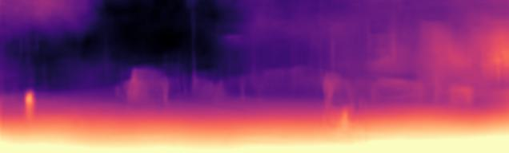

# Validating [Lite-Mono](https://github.com/noahzn/lite-mono)

Max Rensen, Thomas Kamminga, Friso de Kruiff

April 2023 

## Table of Contents

- [Introduction](#introduction)
- [Method](#method)
- [Reproduction Details](#reproduction-details)
- [Experiments](#experiments)
  - [Training the Model in a Limited Environment](#training-the-model-in-a-limited-environment)
  - [Scale Analysis](#scale-analysis)
  - [Additional Feature Wise Attention](#additional-feature-wise-attention)
  - [Alternative Dataset Evaluation](#alternative-dataset-evaluation)
- [Conclusion](#conclusion)
- [References](#references)

## Introduction

In this project, we will be validating, testing and extending the limits of the
Lite-Mono model for monocular depth estimation [8]. This model can be used to
estimate the depth of objects in a single image, a task which typically requires
a stereo image pair, i.e. an image for the left eye and an image for the right
eye. For the validation, we perform various tests on the model. Firstly, we
compute loss curves for our various altered models, in order to ensure no over-
or underfitting is present. After that, we perform an analysis of the model
trained on various scales of the input images. Thirdly, we experiment with
adding squeeze-and-excitation blocks to the architecture of the model. Lastly,
we validate the performance of the model on an alternative dataset, which has
a significantly different distribution from the training dataset.

## Method

Given an image, the trained model hallucinates the (normalized) disparity map
corresponding to the image. The disparity is typically used to measure the
distance between the same pixel in two images captured from a different per-
spective, using scaling factors derived from the to the relation between the two
images, the depth is computed in an inversely proportional manner. So, to then
compute the depth, the resulting disparity map is inverted, and since the model
has been trained to generate the normalized disparity, the outcome directly
corresponds to the estimated depth.

One of the main focuses of the Lite-Mono paper, besides generating con-
vincing depth maps, is to make the model lightweight. To achieve this, the
authors focused on creating a lightweight encoder by employing many convo-
lution and attention components, which make extensive use of weight sharing,
and thus reduce the number of parameters in the model. An overview of the
model architecture is shown in Figure 1.

CNNs are known to have limited receptive fields, which is why the authors
made use of Consequtive Dilated Convolutions, so the model is able to ”ob-
serve” a larger part of in the input image. In addition, a key component of the
model are the Local-Global Feature Interaction (LGFI-)blocks, these make use
of cross-covariance attention to perform feature wise attention and reduce model
complexity. The model is trained in a self-supervised manner by combining an
image reconstruction loss between the target image and synthetic target image
and an edge-aware smoothness loss on the predicted depth map. The target
image used for the reconstruction loss term is either the next or previous image
in a sequence relative to the current frame. The synthetic target is computed
by applying a transformation on the current frame, using the estimated camera
pose from a pre-trained PoseNet [3] in combination with the estimated depth
from the model. This transformation takes the image space coordinates and
depth for each pixel, and uses the camera pose to translate it to the world space
coordinates, then it performs the inverse of this operation to compute the image
space coordinates in the synthesized target image using its camera pose.

  
Figure 1: Overview of the Lite-Mono architecture [8].

## Reproduction Details

To train and validate the model, we made use of the code provided by the
authors of Lite-Mono. This codebase makes use of [PyTorch](https://pytorch.org/), and provides
the necessary functions for loading the data, training the model and evaluating
the output. Only minor changes were required to run the codebase on more

modern versions of PyTorch and other dependencies. Further details on our
training procedures and reproduction details are provided in Section 4.1.

## Experiments

The following sections describe the experiments we performed on the model,
their methodology and their results.

##  Training the Model in a Limited Environment

To do further research on the model we wanted to be able to train the model
on our own lightweight architecture and do it in a reasonable time. The first
problem is that the original Kitti dataset is of considerable size, namely 175GB.
We wanted to reduce the size so chose a subset of the data. This subset is about
a third of the size and makes the training process more manageable on our
hardware, but can raise the concern that we may end up overfitting the model
to the data. To check this we trained the model on our subset and compared the
accuracy of the model on the train and validation set. Furthermore, we pruned
the unavailable files from the training and validation split introduced by Zhou
et al [9], which reduced them to about a third as well. In the original paper,
multiple statistics are used to compare the accuracy of the model. One of these
statistics, which we will use, is the absolute relative difference,

$$\text{Abs Relative Difference} = \frac{1}{|T|} \sum_{y \in T}\frac{\left|y-y^{\ast}\right|}{y^{\ast}}$$

In Figure 2 we see the absolute relative difference during the training process
for the quarter and half resolution model. The quarter-resolution model uses
the least amount of data so has the highest risk of overfitting, but on both
models, we see that there is no big difference between training and validation
error so this is not the case. The other measures of the error also show no sign
of overfitting so the limited training set can still be useful to compare different
models.

  
Figure 2: Absolute relative difference during 32 epochs on the training and
validation set for both the quarter resolution and half resolution model.

## Scale Analysis

The Lite-Mono architecture has the option to choose the resolution that the
model trains on. In Figure 1 this is represented by the constant W for width
and H for height. You would expect that a model trained on higher-resolution
pictures would perform better since there is more data to interpret the depth.
There is however a tradeoff since when you use higher-resolution pictures more
GPU ram is consumed. So when training you have to choose between a big
batch size or a higher resolution. To test the difference we trained the model
with quarter resolution meaning W, H = 320, 96 and half resolution so W, H =
620, 192. The training progress over time can be seen in Figure 3. The quarter-
resolution model is quicker to train and gives a similar error when both use a
batch size of 20. So for this particular dataset, the quarter-resolution model
seems to be sufficient and a bigger batch size can be chosen to more accurately
approximate the gradient in the SGD process.

  
Figure 3: Absolute relative difference over time during 32 epochs on the training
and validation set for both the quarter resolution and half resolution model.
Both sessions used a batch size of 20.

The results of evaluation after our training of the Lite-Mono model at dif-
ferent resolutions are shown in the table below:

### Kitti

| --model | Input size | Abs Rel | Sq Rel | RMSE  | RMSE log | delta < 1.25 | delta < 1.25^2 | delta < 1.25^3 |
|:-------:|:----------:|:-------:|:------:|:-----:|:--------:|:------------:|:--------------:|:--------------:|
| Full    | 1024x320   | 0.096   | 0.861  | 5.334 | 0.167    | 0.887        | 0.966          | 0.988          |
| Half    | 640x192    | 0.101   | 1.048  | 5.318 | 0.167    | 0.901        | 0.966          | 0.985          | 
| Quarter | 320x96     | 0.111   | 1.076  | 5.518 | 0.179    | 0.874        | 0.960          | 0.984          |

The metrics shown in the table are widely used metrics in literature for
depth estimation tasks [metrics]. For the first four columns in this table, lower
is better, but for the last three columns higher is better. The results presented
here cannot be directly compared with the results presented in the original
paper, as we only use a subset of their data, for both evaluation and training,
so we will not attempt to do so.

## Additional Feature Wise Attention

Traditional convolutional neural networks (CNNs) are widely used in computer
vision tasks, but as their depth and width increase, they become computation-
ally expensive and memory-intensive, making them difficult to scale for larger
datasets and complex tasks. Transformers, which have gained attention in nat-
ural language processing tasks for their self-attention mechanism, are still in the
early stages of computer vision tasks due to the high-dimensional input data
where the spatial location of each pixel or feature map plays a crucial role. The
self-attention mechanism in transformers does not consider the spatial location
of each token, limiting their representational power and reducing performance
in vision tasks. The Lite-Mono architecture uses a combination of both convo-
lutional and transformer layers.

Squeeze-and-excitation (SE) networks and blocks have shown remarkable
results in computer vision tasks by modeling channel dependencies and adap-
tively weighting feature maps to emphasize important features. SE architectures
require fewer parameters than traditional CNNs and have achieved state-of-the-
art performance on various benchmark datasets, making them suitable for real-
world applications. Compared to traditional CNNs, SE networks and blocks are
computationally efficient and require fewer parameters.

While Lite-Mono has shown impressive results with its efficient design, in-
corporating the lightweight architecture of SE blocks could further enhance
its performance. SE blocks have demonstrated their ability to model channel
dependencies and emphasize critical features in computer vision tasks while re-
quiring fewer parameters than traditional CNNs. Integrating SE blocks into
Lite-Mono could improve its representational power and make it even more
efficient, leading to better depth estimation results.

To improve the performance of our CNN for image classification, we in-
serted SE blocks between consecutive Dilated Convolution blocks and Local
Global Feature Interaction (LGFI) blocks. SE blocks help the network to learn
channel-wise dependencies and selectively amplify informative features, enhanc-
ing the discriminative power of the network. Additionally, LGFI blocks capture
both local and global contextual information, helping the network to better un-
derstand the relationships between different parts of an image. By combining
these two techniques, we aimed to create a CNN that could effectively extract
and integrate important features from different scales and resolutions

  
Figure 4: Absulolute relative difference measure during the training process of
32 epochs on the original quarter resolution model and the same model with
the SEB block added.

Hyperparameters such as learning rate, weight decay, and dropout rates are
critical components in deep learning models that need to be fine-tuned for opti-
mal performance. Without proper tuning, even state-of-the-art models may fail
to achieve their full potential. As pointed out in [6], extensive hyperparameter
search is essential for finding the best values for these parameters. This can be a
time-consuming and computationally expensive process, but it can significantly
impact the model’s performance.

Similarly, the choice of training schedule can also significantly impact the
convergence of the model. Factors such as the number of epochs, batch size,
and learning rate schedule can influence the speed and stability of the training
process. It is often necessary to adjust these parameters based on the charac-
teristics of the dataset and the model architecture. As noted in [7], the training
procedure needs to be optimized separately for each architecture to make a fair
comparison between different models.

Therefore, it is not surprising that incorporating the lightweight architecture
of squeeze-and-excitation (SE) blocks into the model did not result in signifi-
cant performance improvements, as reported in Figure 4. The lack of extensive
hyperparameter search and training schedule adaptation could have played a
crucial role in the outcome. Nonetheless, the fact that similar performance was
achieved with the new architecture implementation indicates the initial viabil-
ity of the SE-blocks in combination with the current architecture of Lite-Mone,
as discussed in [2]. It remains to be seen whether further fine-tuning of the
hyperparameters and training schedule could lead to better performance gains.

The code for this module can be found on the `SEB_module` branch.

## Alternative Dataset Evaluation

The Lite-Mono model has been trained and mainly evaluated on the KITTI
dataset. However, the KITTI dataset [1] exclusively contains sequences of im-
ages taken from the point of view of a car on the road, which means the recorded
depth values typically range from 3 to 50 meters (see Figure 5).

  
Figure 5: Histogram of depth values in the Kitti dataset.

That observation, along with the fact that the objects in the scenes are
limited to objects expected on or near roads, caused us to speculate the model
would not generalize well on close-range data or unseen objects, such as that
found in the Middlebury dataset [5]. This dataset is typically only used for
evaluation and testing, as it contains only a few dozen training samples, which
is likely not enough to train any network from scratch. A comparison of the
depth of the two datasets is shown in Figure 6, which shows the clear contrast
between the two datasets.

  
Figure 6: Overlayed histograms of depth values in the Kitti and Middlebury
datasets.

The authors have tested the generalizability of their model by evaluating on
a different external dataset, namely the Make3D dataset [4]. However, as the
authors mention, this alternative dataset mostly contains outdoor images, for
which the overlap with the depth and expected objects of Kitti is likely quite
substantial.
To test our hypothesis, we ran the same evaluation from the Kitti dataset
on the Middlebury dataset and got the following results:

### Kitti

| --model | Input size | Abs Rel | Sq Rel | RMSE  | RMSE log | delta < 1.25 | delta < 1.25^2 | delta < 1.25^3 |
|:-------:|:----------:|:-------:|:------:|:-----:|:--------:|:------------:|:--------------:|:--------------:|
| Full    | 1024x320   | 0.096   | 0.861  | 5.334 | 0.167    | 0.887        | 0.966          | 0.988          |
| Half    | 640x192    | 0.101   | 1.048  | 5.318 | 0.167    | 0.901        | 0.966          | 0.985          | 
| Quarter | 320x96     | 0.111   | 1.076  | 5.518 | 0.179    | 0.874        | 0.960          | 0.984          |

### Middlebury

| --model | Input size | Abs Rel | Sq Rel | RMSE  | RMSE log | delta < 1.25 | delta < 1.25^2 | delta < 1.25^3 |
|:-------:|:----------:|:-------:|:------:|:-----:|:--------:|:------------:|:--------------:|:--------------:|
| Full    | 1024x320   | 0.379   | 1.152  | 2.352 | 0.423    | 0.380        | 0.687          | 0.878          |
| Half    | 640x192    | 0.378   | 1.259  | 2.297 | 0.432    | 0.417        | 0.689          | 0.856          |
| Quarter | 320x96     | 0.349   | 1.099  | 2.224 | 0.437    | 0.407        | 0.683          | 0.852          |

An important thing to note is that the first four columns are not scale-invariant,
meaning that scaling of the depth in an image results in a proportional scaling
of the errors and differences in the table. For this reason, the first four columns
of the tables cannot be directly compared with one another. However, we can
still reason about these columns namely the RMSE columns, for which the
model performs better for the regular RMSE on Middlebury, but worse for the
log of the RMSE. The last three columns of the tables are scale-invariant, as
the ground truth is divided by the estimate or vice versa (the minimum of
the two), meaning these columns are relative and can be directly compared.
Performing this comparison shows that all three versions of the model perform
significantly better on all three metrics for the Kitti dataset, when compared to
the Middlebury dataset, on average 58% better.

During the evaluation, we made sure to keep the comparison fair, by fix-
ing parameters whenever possible, such as the size of the images. However, an
unavoidable difference between the two datasets is that the depth data in the
Kitti dataset consists of Velodyne points obtained from a laser scanner. These
points indicate the depth at each location and are quite sparse, i.e. roughly
4% information density per image in the dataset. On the other hand, the Mid-
dlebury dataset contains disparity data, which is nearly complete, i.e. roughly
95% information density per image, this disparity can be directly converted to
depth with the corresponding camera calibration parameters. We expect this
difference in density and representation to not have a significant influence on the
results, as only non-empty ground truth pixels are compared to the prediction
and all disparity data is normalized and transformed to depth before compar-
ison. This will however result in a higher variance in the evaluation metrics
of Kitti, but this should be averaged out with a sufficient number of samples
used in the evaluation. An example image and the corresponding ground truth
disparity data for both datasets are shown in Figure 7. An interpolated ver-
sion of the ground truth disparity for the same image from the Kitti dataset is
shown in Figure 8, which has been interpolated using nearest neighbor, after
which a Gaussian filter is applied to smooth the result. This interpolated image
is only meant to more clearly visualize the sparse disparity data shown in the
previous figure, it is not used for any evaluation or training. However, since
the Lite-Mono model does not make use of the ground truth depth maps for
training, it could potentially be used as an additional loss term to speed up the
initial training. This additional loss term would require a decaying coefficient,
as the interpolated disparity is inaccurate and should only be used as an guide-
line, though the sparse representation could still be used for fine tuning at later
epochs.

  
  
  
  
Figure 7: Example of images and their corresponding ground truth disparity for
the Kitti Full (top) and Middlebury (bottom) datasets.

  
  
Figure 8: Kitti image pair from Figure 7 with interpolated disparity values for
the ground truth.

The corresponding predictions of the example images made by our trained Lite-
Mono network are shown in Figure 9.

  
  
  
  
Figure 9: Example image ground truth disparity and their corresponding pre-
dicted disparity for the Kitti Full (top) and Middlebury (bottom) datasets.

## Conclusion

In summary, we first evaluated the Lite-Mono architecture with SE-blocks on a
smaller dataset with different resolution settings, and observed that the quarter-
resolution model was sufficient to train the model without overfitting. Using
this resolution setting we demonstrated the initial viability of incorporating SE-
blocks into the architecture, and we achieved similar performance compared to
the original model. Moving forward, we expect to improve the performance
through hyperparameter tuning and training schedule optimization.

However, our evaluation on an alternative dataset showed that the model
did not generalize well on data with unseen objects or different depth distri-
bution. Both a visual and empirical analysis revealed the discrepancy between
the two training datasets and the unseen dataset. This highlights the need for
further improvement and optimization to ensure the model’s robustness and
applicability to a broader range of scenarios.

## References

[1] A Geiger et al. “Vision meets robotics: The KITTI dataset”. In: The In-
ternational Journal of Robotics Research 32.11 (2013), pp. 1231–1237. doi:
10.1177/0278364913491297.

[2] Jie Hu, Li Shen, and Gang Sun. “Squeeze-and-excitation networks”. In:
Proceedings of the IEEE conference on computer vision and pattern recog-
nition. 2018, pp. 7132–7141.

[3] Alex Kendall, Matthew Grimes, and Roberto Cipolla. PoseNet: A Convolu-
tional Network for Real-Time 6-DOF Camera Relocalization. 2016. arXiv:
1505.07427 [cs.CV].

[4] Ashutosh Saxena, Min Sun, and Andrew Y. Ng. “Make3D: Learning 3D
Scene Structure from a Single Still Image”. In: IEEE Transactions on
Pattern Analysis and Machine Intelligence 31.5 (2009), pp. 824–840. doi:
10.1109/TPAMI.2008.132.

[5] Daniel Scharstein et al. “High-Resolution Stereo Datasets with Subpixel-
Accurate Ground Truth”. In: German Conference on Pattern Recognition.
2014.

[6] Leslie N Smith. “A disciplined approach to neural network hyper-parameters:
Part 1–learning rate, batch size, momentum, and weight decay”. In: arXiv
preprint arXiv:1803.09820 (2018).

[7] Ross Wightman, Hugo Touvron, and Herv ́e J ́egou. “Resnet strikes back: An
improved training procedure in timm”. In: arXiv preprint arXiv:2110.00476
(2021).

[8] Ning Zhang et al. “Lite-Mono: A Lightweight CNN and Transformer Ar-
chitecture for Self-Supervised Monocular Depth Estimation”. In: arXiv
preprint arXiv:2211.13202 (2022).

[9] Tinghui Zhou et al. “Unsupervised Learning of Depth and Ego-Motion
from Video”. In: CoRR abs/1704.07813 (2017). arXiv: 1704.07813.

